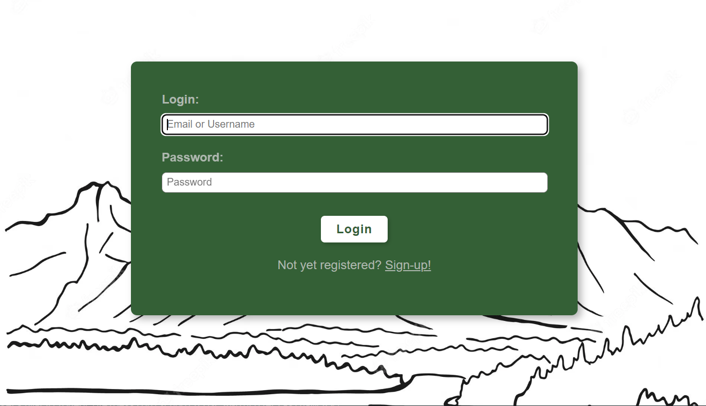
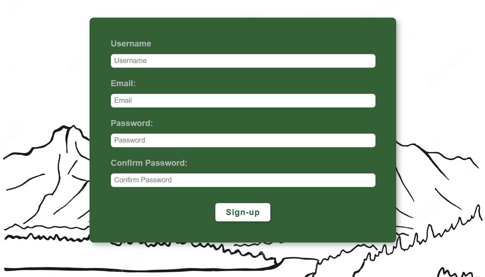
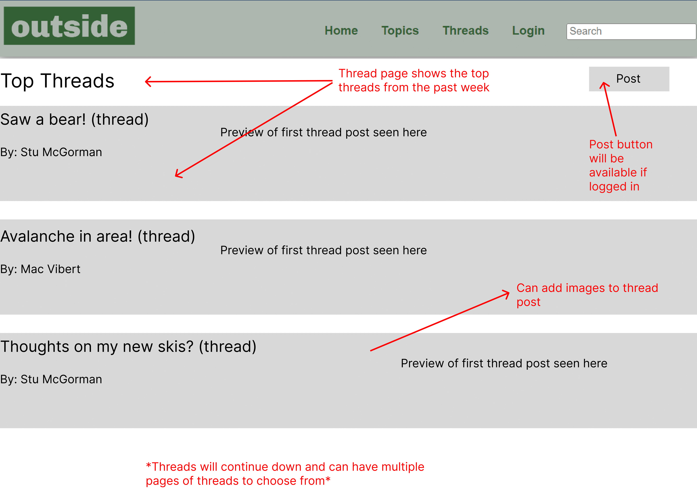
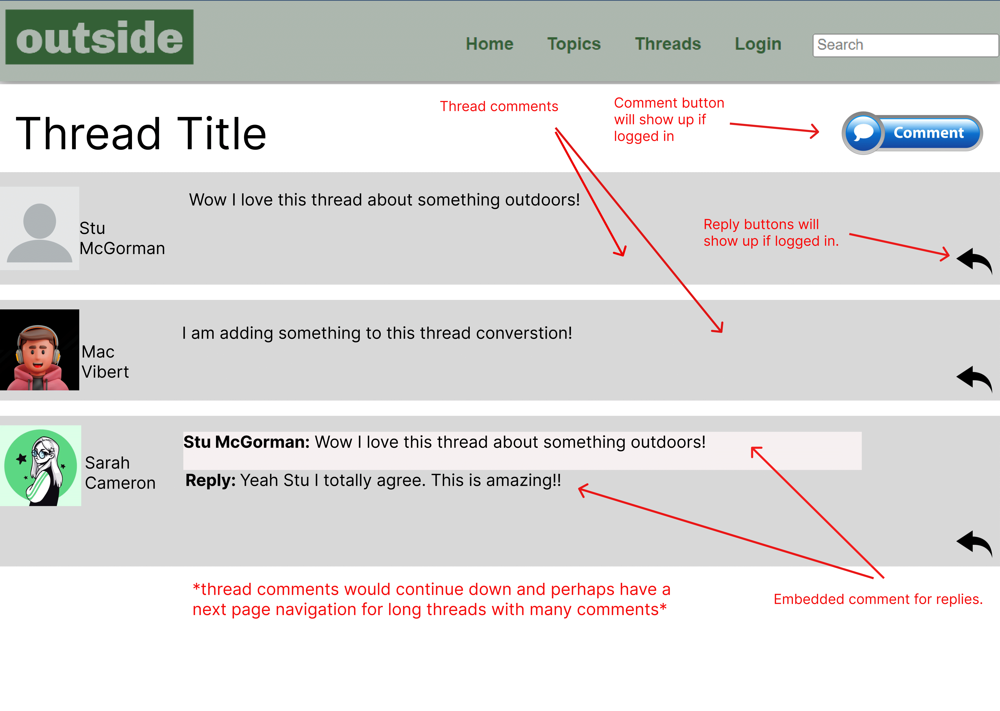
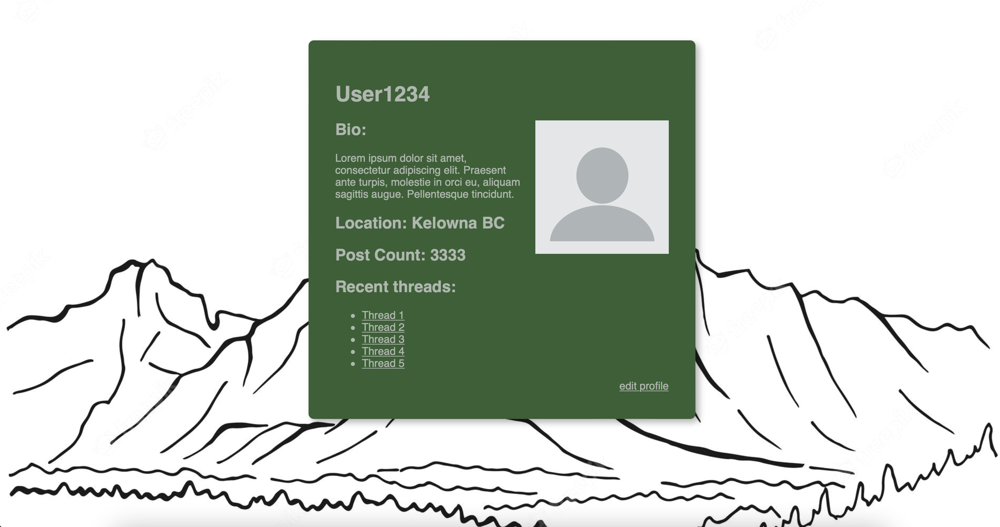

# Proposed page layouts
### Header 

Static html in frontend folder. Will use php to have header remain on every page. Clicking 'login' will route user to login page. Once logged in 'login' will change to their username and they'll be able to navigate to their account page by clicking their username. Header menu will likely change.
### Login 

Users can login using their username or email. If they are not yet signed up they can click the sign-up link at the bottom to navigate to the sign-up page. Added basic client side validation. Will add server side account validation for accouts later. 
### Signup

Users sign up my picking a username, providing their email and creating a password. Added client side validation for all fields. Will add server side validation to make sure username isn't already taken later. 
### Threads page

Here is the main page where users can browse the top threads for viewing. They can click on any thread from the list to travel to it's thread page. Users will also be able to see the post button if they are logged in. 
### Thread page

This is a thread page. When a user visits a thread they can see the title and all the replies/comments. In order to comment or reply the user must be logged in. Once they have logged in they will see the comment and reply buttons and they'll be able to participate. Otherwise, they can just read the thread. 
### Profile Page

This is a profile page. When a user views a profile page it can see that users information as well as links to their most recent threads. I a user is logged in and they are view their own profile then they will have access to a edit profile button in the corner which will allow then to change their profile information.

### Overall design and style
We will have a consistant header at the top of each page and a consistent color scheme using greens and greys which relates to the outdoors. For pages such as threads which require more on the screen we will use the full page and on simpler pages such as the login page or profile pages we will put the content in a green div floating above a drawing of a mountian. 